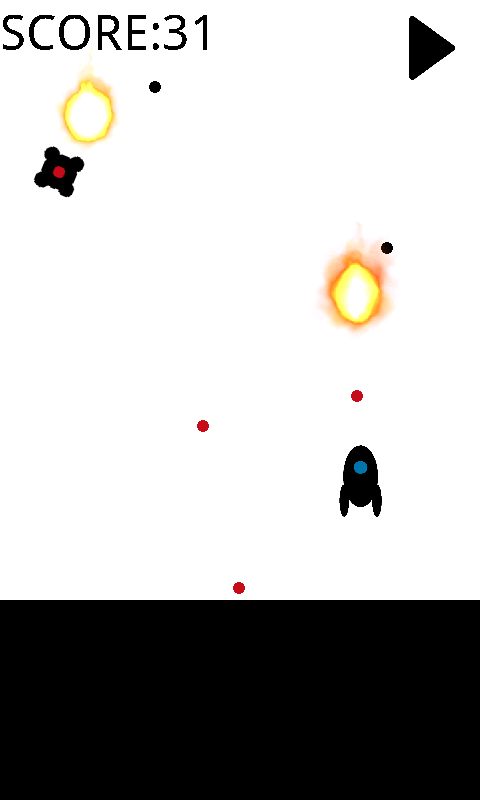

# PON SHOOTING
PON SHOOTING is a 2D shooting game for Android.

## Requires Android
2.3.3 and up

## ScreenShot

## ADE
Android Studio

## Attention to build
If you want to build,
you need to prepare 2 soud files named "beamsound.mp3" and "hitsound.mp3". (not mp3 is OK.)
And put them under /app/src/main/res/raw/    

## Stuff
- http://www.music-note.jp
- http://ionicons.com
- http://piposozai.wiki.fc2.com

## License
- This software is released under the MIT License.  
Copyright (c) 2014 masaponto  
http://opensource.org/licenses/mit-license.php  
      
        
- This software uses [Ionicons](http://ionicons.com/ "Ionicons"), which is licensed by the MIT License.  
Copyright (c) 2014 Drifty (http://drifty.com/)  
http://opensource.org/licenses/mit-license.php  